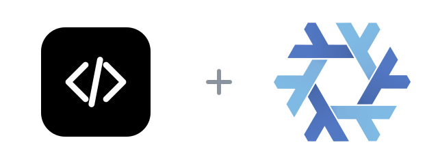

<p align="center">
  
</p>

<h1 align="center">codex-flake</h1>

<p align="center">
  <a href="flake.nix"></a>
  <a href="LICENSE"></a>
  <a href="https://github.com/openai/codex/releases/tag/rust-v0.161.0"></a>
</p>

[Codex](https://github.com/openai/codex) is OpenAI's coding agent that runs locally in your terminal.

This flake packages the official prebuilt Codex package bundle from the upstream release: the static musl `codex` binary together with the helpers it expects beside it, including the code-mode host, `ripgrep`, and `bubblewrap`. There is no Rust toolchain build and no npm wrapper, so nothing is compiled at install time. It supports x86_64 and ARM64 Linux.

```sh
nix run github:Fractal-Tess/codex-flake -- --version
```

Build it without running:

```sh
nix build github:Fractal-Tess/codex-flake#codex
```

## Install in a Nix configuration

Add the flake input:

```nix
inputs.codex-flake.url = "github:Fractal-Tess/codex-flake";
```

Use the NixOS or Home Manager module:

```nix
# NixOS
{
  imports = [ inputs.codex-flake.nixosModules.default ];
  programs.codex.enable = true;
}

# Home Manager
{
  imports = [ inputs.codex-flake.homeManagerModules.default ];
  programs.codex.enable = true;
}
```

The module defaults to the flake package. Override `programs.codex.package` if needed, or use `overlays.default` to expose `pkgs.codex`:

```nix
{
  nixpkgs.overlays = [ inputs.codex-flake.overlays.default ];
  environment.systemPackages = [ pkgs.codex ];
}
```

Because the package lives in the Nix store it is immutable, so update it through the flake rather than with any in-place self-updater.

Codex keeps its own configuration and session state under `~/.codex`; installing this package does not manage or migrate that data.

## Update

The daily [update workflow](.github/workflows/update.yml) runs at 12:00 UTC, resolves the latest stable `rust-v` release, refreshes both Linux hashes, validates the package, and commits an update. Prereleases and the many non-`rust-v` tags in the upstream repository are skipped. Run the same process locally with:

```sh
./scripts/update.sh
```

Pass a stable version such as `./scripts/update.sh 0.161.0` to update to a specific release. The workflow can also be started manually from GitHub Actions.

## Credits and mirrors

[GitHub](https://github.com/Fractal-Tess/codex-flake) · Gitadel: `ssh://git@neo.netbird.cloud:2222/fractal-tess/codex-flake.git`

The flake packaging is [MIT](LICENSE). Codex is [Apache-2.0 licensed](https://github.com/openai/codex/blob/main/LICENSE), © OpenAI.

The lockup pairs a stylized black-and-white mark drawn for this repository — not an official OpenAI asset — with the [Nix snowflake](https://github.com/NixOS/nixos-artwork/tree/master/logo) by Simon Frankau and Tim Cuthbertson ([CC BY 4.0](https://creativecommons.org/licenses/by/4.0)), resized and arranged here. OpenAI is not affiliated with or endorsing this flake.
